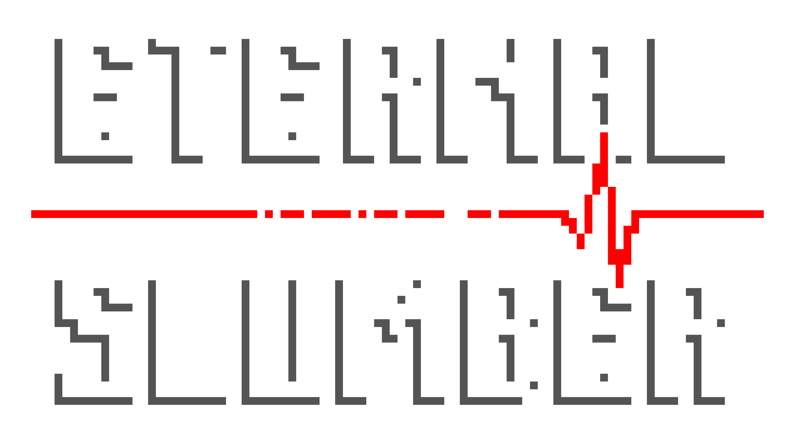

# CTD 1D Project - SC06 Group 6E
## Group Members
| Name                               | ID      | Role                |
| :--------------------------------- | :-----: | :------------------ |
| Lindero Dianthe Marithe Lumagui    | 1007213 | GitHub expert       |
| Lim Donggeon                       | 1007068 | Markdown enthusiast |
| David Ling De Wei                  | 1007175 | Copilot replacement |
| Evan Ang Jun Ting                  | 1006616 | Rare sane person    |
| Mithunbalaji Mageswari Ganeshkumar | 1007494 | "owoaughAASDHAJS"   |
| Pham Hong Quan                     | 1007131 | Taking commissions  |

## Project Summary
Our game is titled *Eternal Number Slumber*:

To find out more about the the game, its gameplay, design directions, and concept artworks, check out our [***game wiki***](game_wiki.md)!

To find out more about our programming decisions, principles, and documentation, check out our [***code documentation***](code_documentation.md)!

 

# For Internal Use
### Quick Links
- [Progess Tracker](https://sanalog.notion.site/889e31923ee34c17b81921d9106d6d3a?v=1e52cd7881d34aecbbef3fabb7da94b3)
- [Python 3.9 Standard Library](https://docs.python.org/3.9/library/)
- [Official Tkinter documentation](https://docs.python.org/3/library/tk.html)
- [TkDocs](https://tkdocs.com/about.html)

### Key Progress 
| Items                                     | Deadline | Status |
| :-----------------------------------------| :------: | :----: |
| Read project brief                        | 14 Nov   | ✅
| Set up GitHub repository                  | 14 Nov   | ✅
| Create [game wiki](Game_wiki.md)          | 21 Nov   | ✅
| Create [code docs](Code_documentation.md) | 01 Dec   | ✅
| Start programming                         | 01 Dec   | ✅
| Final assembly and playtesting            | 06 Dec   | ✅
| Submission of deliverables                | 07 Dec   | ✅
| Easter Eggs and Packing into .EXE         | OTOT     | ⬛
| Port game using external libraries        | OTOT     | ⬛
